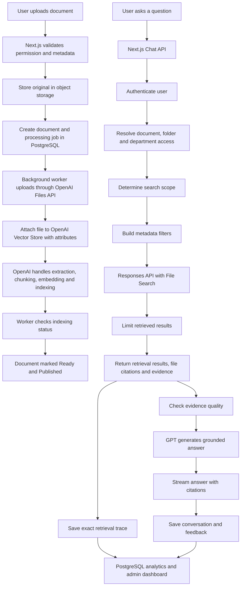

# Beforest Knowledge Assistant

A Next.js knowledge management and RAG assistant for Beforest AI.

The application lets permitted users upload documents, browse indexed knowledge, ask questions against an OpenAI vector store, review retrieval quality, collect feedback, and manage users/admin settings from a live dashboard.

## What this app does

- Upload documents into a knowledge workspace
- Send uploaded files to the configured OpenAI vector store
- Ask questions using GPT with grounded source references
- Store chat history, feedback, document metadata, users, projects, and admin settings
- Support role-based access:
  - Admin: full access
  - User: Knowledge, upload documents, Ask Beforest
- Track search history, feedback, retrieval quality, low-confidence cases, and operational health
- Invite users with admin-created credentials and optional SMTP email delivery

## Current RAG architecture

The target production architecture uses the OpenAI Vector Store as the retrieval/indexing layer and PostgreSQL as the application source of truth. For local testing, the same application records are stored in SQLite.



Local MVP behavior:

- SQLite stores users, chats, document records, processing jobs, feedback, retrieval traces, admin settings, and analytics.
- Upload still runs synchronously through the Next.js API for local testing.
- Object storage and a background worker are production-phase pieces.
- New OpenAI vector-store files receive production-style attributes.
- Strict metadata filters are available in Admin settings, but should remain off until legacy OpenAI vector-store imports are backfilled with metadata.

Production behavior:

- PostgreSQL should replace local SQLite through `DATABASE_URL`.
- Original files should be persisted in object storage before indexing.
- A background worker should process indexing jobs and update document status.
- Retrieval should use metadata filters for published/current/permitted documents.

## Vector-store file attributes

New uploads attach attributes to the OpenAI vector-store file:

```json
{
  "document_id": "doc_20260730_abc123",
  "department_id": "general",
  "folder_id": "uploaded-documents",
  "document_type": "document",
  "status": "published",
  "version": 1,
  "is_current": true,
  "access_group": "all"
}
```

These attributes are the foundation for department, folder, access-group, version, and published/current filtering.

## Retrieval trace logging

For each chat query, the app stores:

- query
- response ID
- model
- latency
- max retrieved results
- filter used
- source filenames
- top retrieval score
- retrieved file IDs
- document IDs when known
- retrieved text/excerpts
- citation/source names

The default `max_num_results` is `5` to reduce latency and token usage. Admins can tune this in Admin → Settings.

## Tech stack

- Next.js
- React
- TypeScript
- SQLite locally / PostgreSQL through `DATABASE_URL`
- OpenAI API
- OpenAI vector store
- Nodemailer for invite emails

## Environment variables

Create a `.env` file locally. Do not commit it.

```env
DATABASE_URL=

OPENAI_API_KEY=
OPENAI_MODEL=gpt-5-mini
OPENAI_VECTOR_STORE_ID=

DEFAULT_ADMIN_NAME=
DEFAULT_ADMIN_EMAIL=
DEFAULT_ADMIN_PASSWORD=

SMTP_HOST=
SMTP_PORT=
SMTP_SECURE=false
SMTP_USER=
SMTP_PASSWORD=
SMTP_FROM=

APP_URL=http://localhost:3000
NEXT_PUBLIC_APP_URL=http://localhost:3000

MAX_UPLOAD_SIZE_MB=50
```

Notes:

- `DEFAULT_ADMIN_EMAIL` and `DEFAULT_ADMIN_PASSWORD` are required when the database is empty so the first admin can be created.
- `DATABASE_URL` can point to PostgreSQL for production. If it is not provided, the app uses local SQLite.
- `OPENAI_VECTOR_STORE_ID` should be the single OpenAI vector store used by this application.
- SMTP variables are required only if invite emails should be sent automatically.

## Local development

Install dependencies:

```bash
npm install
```

Run locally:

```bash
npm run dev
```

Open:

```text
http://localhost:3000
```

## Production build

```bash
npm run build
npm run start
```

## Validation

Run lint:

```bash
npm run lint
```

Run production build:

```bash
npm run build
```

## Deployment notes for Coolify

Recommended Coolify settings:

- Build command: `npm run build`
- Start command: `npm run start`
- Port: `3000`
- Add all required environment variables in Coolify
- Use a managed PostgreSQL database and set `DATABASE_URL`
- Set `APP_URL` and `NEXT_PUBLIC_APP_URL` to the public application URL

## Git safety

The `.gitignore` excludes:

- `.env`
- `.env.local`
- `.next`
- `node_modules`
- local SQLite database files under `data/`
- runtime storage files

Before pushing, confirm:

```bash
npm run lint
npm run build
```

## Suggested first production checklist

- Set real `DEFAULT_ADMIN_EMAIL` and `DEFAULT_ADMIN_PASSWORD`
- Set real `OPENAI_API_KEY`
- Set `OPENAI_VECTOR_STORE_ID`
- Set production `DATABASE_URL`
- Set SMTP configuration if invite emails are required
- Confirm user roles in Admin → Users
- Upload and test at least one document
- Ask a test question in Ask Beforest
- Confirm search history, feedback, and retrieval quality data appear in Admin
